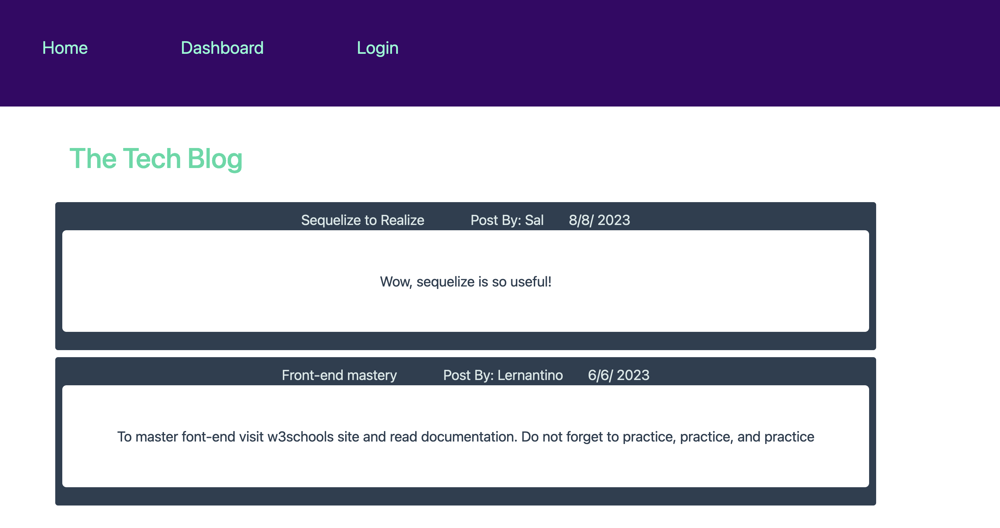
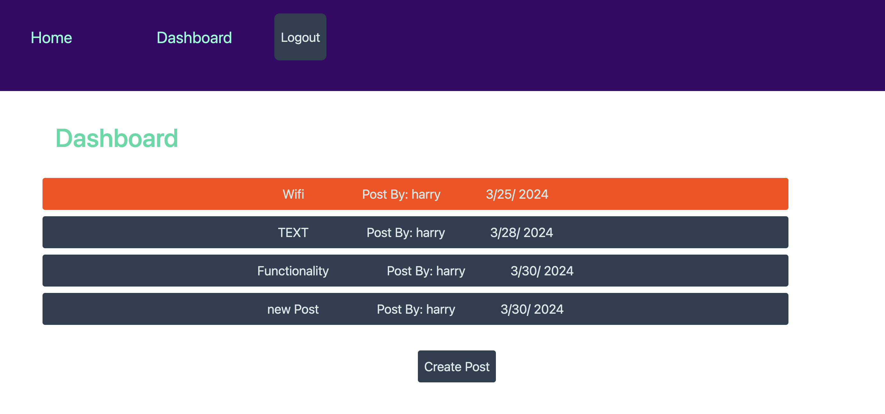

# Full-Stack-Blog

## Building a Full-Stack Blog

The purpose of this project is to create a full-stack blog. This means the development of the front-end (Client-side) and the back-end (Server-side). In the application, the user is presented with a home, dashboard, and login pages. Developing this project demonstrates our full-stack development skills using Mysql2, Nodejs, Express js, Dotenv, Bcrypt, Express-handlebars, Express-sessions, connect-session-sequelize, Heroku, and Sequelize.

This project was developed with Sequelize version ^6.37.0 Using Sequelize assisted in forming and structuring of the database models. Along with forming the models, Sequelize was used for seeding, and the management of data. Insomnia was used to implement Express js methods.

The following is an image is the home page that has the featured posts.

The Following image is example of the current user's listed posts.

## Installation

N/A

## Usage

To view the application in action, simply click the following link: https://pacific-meadow-34307-80829f509aa3.herokuapp.com/
The link will redirect you to Heroku where the user can see the application in action. The full-stack-blog application functionality allows the user to view, create, and delete posts. The users can also comment other members' posts. 

## Credits

N/A

## License

Please refer to the LICENSE in the repo.